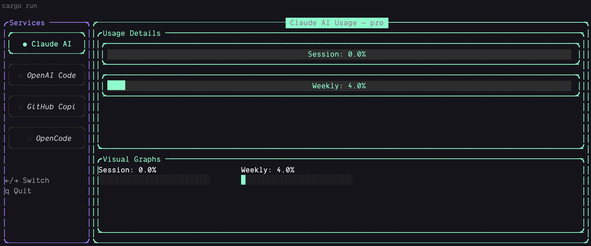
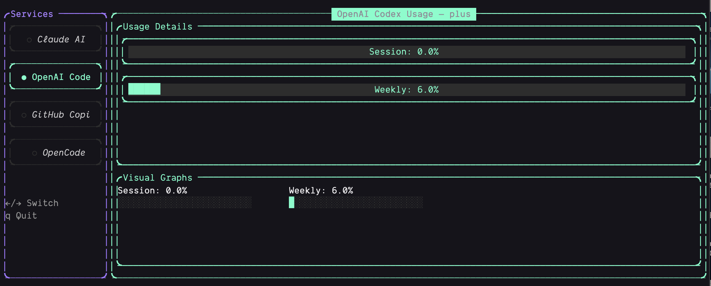

# AI Usage CLI (POC)

A simple Terminal User Interface (TUI) and CLI tool to monitor your usage across various AI services. This project is a **Proof of Concept (POC)** and a learning exercise for Rust.

## Screenshots

|            Claude            |            OpenAI            |
| :--------------------------: | :--------------------------: |
|  |  |

> [!IMPORTANT]
> This is a learning project and is not intended for active maintenance. Expect minimal updates.

## Supported Services

The tool currently attempts to fetch usage data from the following services:

- **Claude AI**: Integration with Claude Code / Claude.ai usage limits.
- **OpenAI Codex**: Tracking for Codex/API-related limits.
- **GitHub Copilot**: Monitoring remaining chat and premium interaction quotas.
- **OpenCode**: Integration via the `opencode` CLI.

## Features

- **TUI Mode**: A visual dashboard built with `ratatui` to cycle through different services.
- **Headless Mode**: Output usage statistics directly to the terminal for scripting or quick checks.
- **Automatic Token Refresh**: Attempts to refresh OAuth tokens for supported services (like Claude) using stored credentials.
- **Keychain Integration**: On macOS, it can read credentials from the system keychain for Claude.

## Installation

Ensure you have [Rust and Cargo](https://rustup.rs/) installed.

```bash
git clone <repository-url>
cd ai-usage-tui-main
cargo build --release
```

The binary will be available at `./target/release/ai-usage-cli`.

## Usage

### Interactive TUI

Run the application without arguments to enter the TUI:

```bash
./target/release/ai-usage-cli
```

- Use `Tab` or `Right Arrow` / `Left Arrow` to switch between services.
- Press `q` to quit.

### Headless Mode

Get a one-time snapshot of your usage:

```bash
./target/release/ai-usage-cli --headless
```

### Specific Service

Force the application to start with a specific service:

```bash
./target/release/ai-usage-cli --service=copilot
./target/release/ai-usage-cli --service=claude --headless
```

## Requirements

- **Claude**: Requires being logged in via the `claude` CLI or having a valid `.credentials.json` in `~/.claude/`.
- **OpenCode**: Requires the `opencode` CLI to be installed and authenticated.
- **Copilot/Codex**: Depends on local authentication states and configuration files.

## License

MIT (or whatever license you prefer for a POC).
